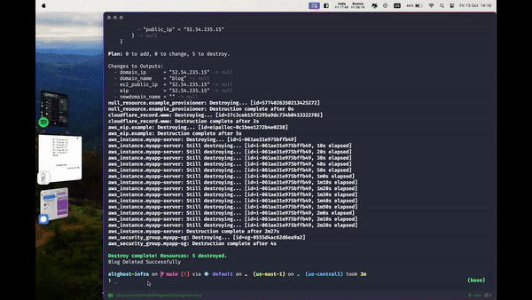
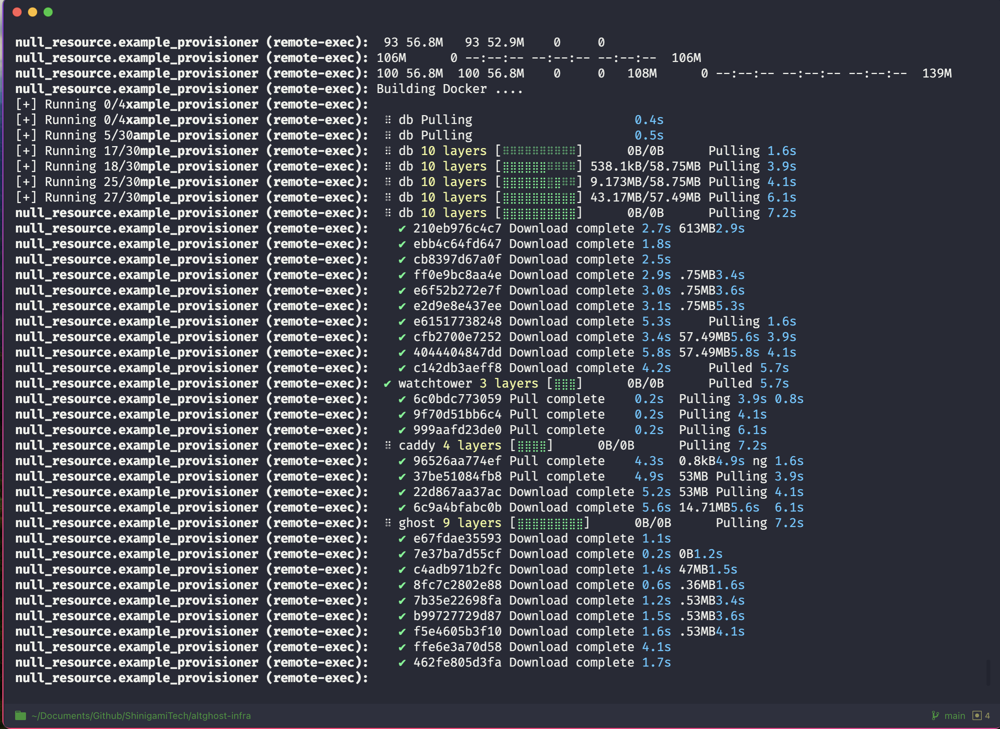

# Ghost Blog Self-Hosting Automation

Easily self-host your Ghost blog with a single command using this automation script. 
This project leverages Terraform and Shell scripts to provision a VM, set up a subdomain on Cloudflare, and deploy Ghost on the VM.

## 🚀 Features

- **Easy Setup**: Get your Ghost blog up and running with a single command.
- **Custom Domain**: Automatically configures a custom subdomain for your blog.
- **Scalable**: Choose from different hosting plans to suit your needs. You can also upgrade or downgrade your storage.
- **Automated Updates**: Update your Ghost instance effortlessly.
- **Domain Management**: Update or remove domain settings with ease.
- **Isolated Hosting**: Each blog is hosted in its own EC2 instance with dedicated storage based on the chosen plan.
- **Multi-Blog Management**: Manage multiple blogs on the same AWS account with isolated environments for each.

## Demo
  

### Used Stack

1. Terraform (for creating infrastructure)
2. Shell (for running the infrastructure)
3. Ghost CMS latest docker image (alpine)
4. MySQL 8 docker image
5. Caddy 2 docker image (alpine)
6. Watchtower docker image (to auto-update containers)
7. Docker-compose

## 🛠 Prerequisites

- AWS Account
- Cloudflare Account 
  - Note -> On Cloudflare, navigate to Site -> SSL and set it to Full or Full (strict)
- Terraform installed on your machine
- AWS CLI installed on your machine
- A generated `tf-key-pair.pem` from your AWS account (place this at the root level of this project)

## 🎉 Getting Started

1. **Clone the repository:**

    ```bash
    git clone git@github.com:mamane19/altghost.git
    cd altghost
    ```

2. **Generate and Place Your AWS Key Pair:**

   Generate a key pair in your AWS account named `tf-key-pair` and place the `tf-key-pair.pem` file in the root level of this project. This is crucial for the `remote.txt` file and any other instance where remote connection to your account is required.

3. **Configure AWS and Cloudflare credentials:**

    Update the `terraform` block in the `main.tf` file with your credentials:

    ```terraform
     provider "aws" {
          region                  = "your-aws-region"
          shared_credentials_file = "/path-to-your-aws-credentials" #Example for Ubuntu: /home/ubuntu/.aws/credentials
     }

     provider "cloudflare" {
          email   = "your-email"
          api_key = "your-api-key"
     }

     data "cloudflare_zone" "dptools" {
          name = "your-domain-name" # your domain... example: example.com
     }
    ```

---



### 3.1. Preparation Before Running the Setup Script:
> Choose a plan based on your storage needs:

- **Basic**: 8GB of storage.
- **Standard**: 16GB of storage.
- **Premium**: 32GB of storage.

The scripts and configurations are pulled from an S3 bucket. I did this because I wanted to pull them in the VM and connect to the VM remotely then execute the commands to spin up the different images from the compose file.

By default I disabled multi blogs because I was initially pushing all the config files to S3 but didn't wanna do that for security reasons.  
If you want that you can still do that by uploading your files to an s3 bucket and uncomment the following part in the `createblog` script within the `setup.sh` file: 
```bash
    # we create the folder
    mkdir $2
    # we change the directory to the new folder
    cd $2
    # we pull the s3 bucket content
    aws s3 cp s3://altghost-infra/scripts/ ./ --no-sign-request --recursive # The no sign request is because my bucket is public.  
     # You don't wanna do this if you ahve your secrets in those scripts :)
```
This alteration will generate a directory named either after your blog name or `subdomain_value`. Upon executing the command to create the blog, the directory corresponding to your subdomain_value/blogName will be populated with the files stored in the S3 bucket.  


  
#### Transaction Emails
To enable transactional emails from the get-go, use the .env.example file, copy those variables to a .env file then create your Mailgun or SendGrid credentials, and paste them there. These are utilized in the docker-compose file. Ensure to check the Ghost docs for your specific choice. In this case, SendGrid is used.

Modify the docker-compose.yaml file to uncomment the following:
```yaml
      mail__transport: "${MAIL_TRANSPORT}"
      mail__options__host: "${MAIL_HOST}"
      mail__options__port: "${MAIL_PORT}"
      mail__options__secureConnection: "${MAIL_SECURE_CONNECTION}"
      mail__options__auth__user: "${MAIL_USER}"
      mail__options__auth__pass: "${MAIL_PASSWORD}"
```

Or you can simply add these to the `config.production.json` file for ghost to pick them up automatically once the images are up.
```json
      "mail": {
    "transport": "SMTP",
    "options": {
      "service": "SendGrid",
      "host": "smtp.sendgrid.net",
      "port": 587,
      "secure": true,
      "auth": {
        "user": "",
        "pass": ""
      }
    }
  },
```

If this step is skipped, you can still configure email later.

<br>

4. **Run the Setup Script:**

    ```bash
    ./setup.sh createblog ${subdomain_value} ${plan} ${domain_name}
    ```  
Example: ./script.sh createblog blog basic blog.neopress.io
> blog -- the name of your blog/subdomain_value  
> basic -- the plan (8gb of storage)  
> blog.neopress.io -- the domain_name

This command will create a VM, set up the subdomain on your Cloudflare, and install Ghost on the VM.


## 🖋 Commands

### Key Notes:
- ${subdomain_value} refers to the name you gave your blog, or in other words, the initial subdomain_value you provided when you first created your blog in the step right above the commands.  

- That subdomain_value is used to reference your blog almost everywhere in the written scripts, including the name of your server on AWS.  


Here are some of the commands you can use to manage your Ghost blog:

**Upgrade Blog** 
--> This is basically for upgrading to a greater storage in case you need more storage.
```bash
     ./setup.sh upgradeblog ${subdomain_value} ${plan} 
```  

**Update Domain**  
--> This can also translate to adding custom domain name. Before doing this you need to make sure that you do the following:  
- Go to your DNS Provider
- Create a CNAME Record and point it to the currently pointing subdomain you have your blog running at
- 
```bash
     ./setup.sh domainupdate ${subdomain_value} ${plan} ${domain_name} ${newdomain_name} 
``` 

**Remove Domain**  
--> This is basically when you want remove the custom domain you've set up to get back to the default subdomain you've set when you first installed ghost.
```bash
     ./setup.sh domainremove ${subdomain_value} ${plan} ${domain_name} ${newdomain_name} 
``` 

**Stop Instance**  
--> If for some reasons you want to stop the ec2 instance that's running your ghost blog
```bash
     ./setup.sh stopinstance ${subdomain_value} ${plan} 
``` 

**Start Instance**  --> Restart your instance after stopping it. Note that I used elastic IPs so your data will not be lost.
```bash
./setup.sh startinstance ${subdomain_value} ${plan} 
``` 

**Reset Blog**  
--> If for some reasons you wanna start fresh and want to reset your blog. This will wipe all your data and give you a clean fresh ghost blog.
```bash
     ./setup.sh resetblog ${subdomain_value} ${plan} 
``` 

**Check Storage Usage**  
--> WIP: You can see the storage but I am looking at a nicer way to display it.
```bash
     ./setup.sh checkstorage ${subdomain_value} ${plan} 
``` 

**Delete Blog**  
--> If for some reasons you want to completely delete your blog. This will wipe everything at once. Your blog, your cloudflare subdomain...etc  

NOTE: For delete if you've gone the route of having multi blogs with each one in its own folder, you might need to uncomment the following in the `setup.sh` file
```bash
     # if [ -d "$2" ]; then
     #    cd $2
     ...
     # else
     #   echo "Blog not found"
     #   exit 1
```
```bash
     ./setup.sh deleteblog ${subdomain_value}
``` 

**Delete Ghost**  
--> This will keep your existing infrastructure but will only delete the ghost installation. Meaning the ghost containers and images created by the tf script. This can allow you to rerun the installation script alone to install ghost fresh in your already created VM.
```bash
     ./setup.sh ghostdelete 
``` 
